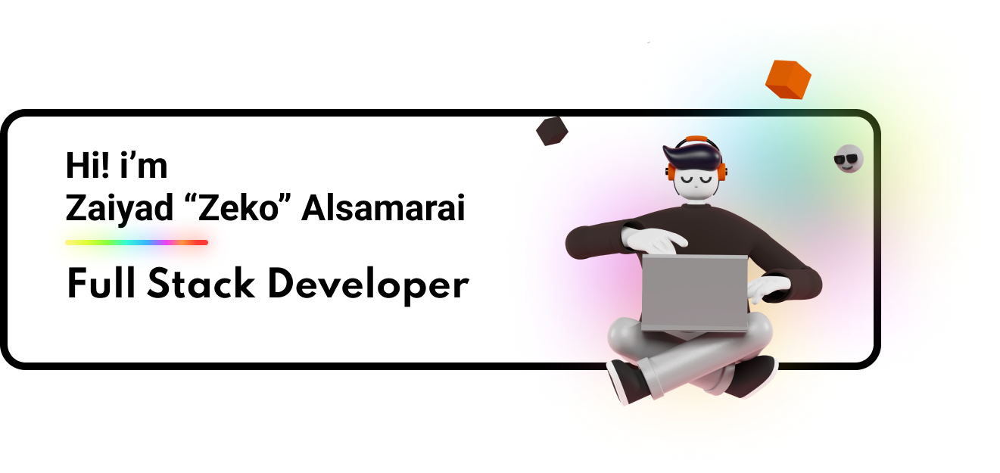

<h2 align="center"> 👨‍💻 Whoami</h2>

  <samp>Hey there! My name is Zaiyad Alsamarai, but you can call me Zeko. I'm a <b>full-stack develoepr and a digital designer</b>. I have recently <b>graduated in May 2022</b> from The College of Idaho with a bachelor's degree in <b>Computer Science</b> and a bachelor's degree in <b>Business Administration</b>. I currently work as a Jr. Systems Engineer, and I'm <b>open for work</b> opportunities as a Jr. Software Developer, so please feel free to reach out. 
   👇 You can also take a look my portfolio below 👇
  </samp>
     
  <a herf="http://zalsamarai.com/">

<h2  align="center">🔨 Languages and Tools</h2>

  
 
 
 
 
 

<h2  align="center">📫 Reach me</h2>

    &nbsp;&nbsp;&nbsp;&nbsp;
    &nbsp;&nbsp;&nbsp;&nbsp;
    &nbsp;&nbsp;&nbsp;&nbsp;

<h2  align="center">📊 My Stats</h2>

    

