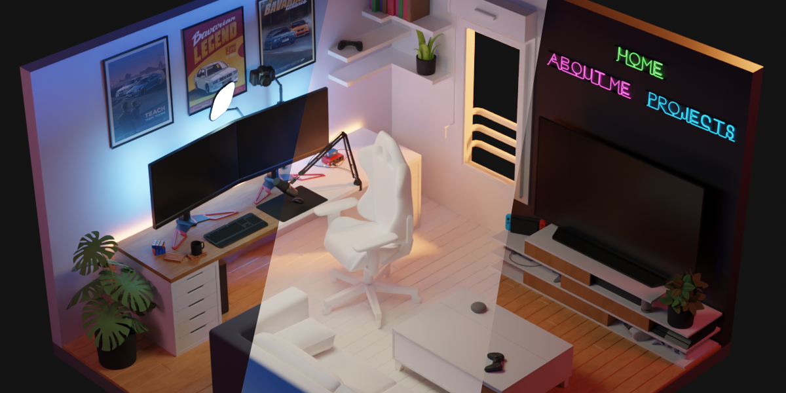

<p align="center">
  <a href="http://zalsamarai.com/">
    
  </a>
</p>
<h3 align="center"> 👨‍💻 Whoami</h3>
<p align="center">

```tsx
const zeko = {
  fullName: "Zaiyad Alsamarai",
  currentPosition: "Software Development Engineer",
  education: [
    "B.S. Computer Science - The College of Idaho",
    "B.A. Business Administration - The College of Idaho"
  ],
  graduationDate: "May 2022",
  openToWork: true,
  portfolio: "https://zalsamarai.com"
};
```
</p>
<br>
<h3 align="center">📫 Reach me</h3>
<p align="center">
  <a target="_blank" href="https://www.linkedin.com/in/zaiyad-alsamarai/">
    
  </a>&nbsp;&nbsp;&nbsp;&nbsp; <a href="mailto:zalsamarai1998@gmail.com?subject=Hello%20Zeko,%20From%20Github">
    
</p>
<br>
<h3 align="center">🔨 What I Work With</h3>
<p align="center">
  <a href="#">
    
  </a>
</p>
<br>
<h3 align="center">🎨 Portfolio</h3>
<p align="center">
  <a href="https://zalsamarai.com/" target="_blank">
    
  </a>
</p>
